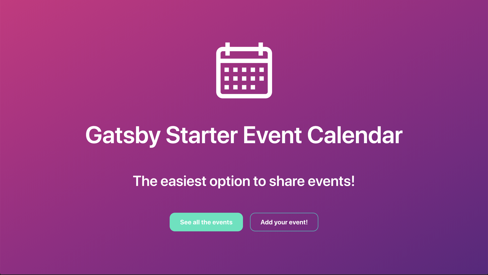
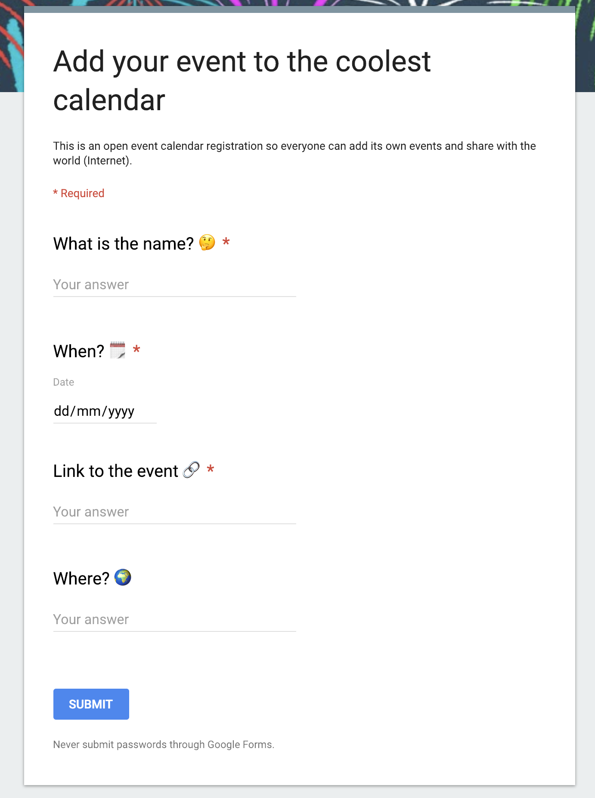
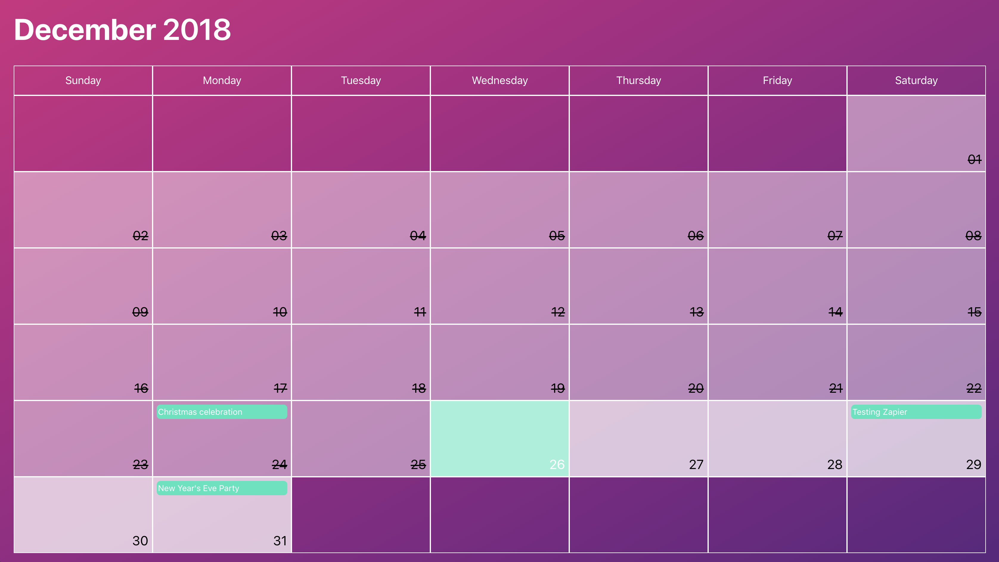
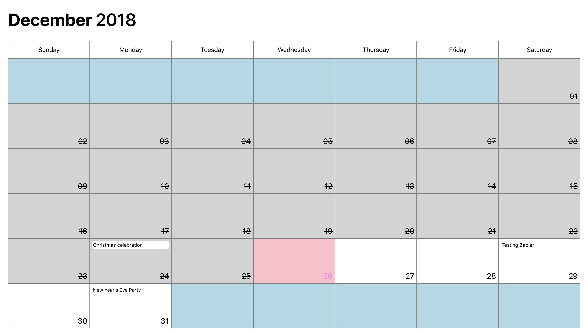
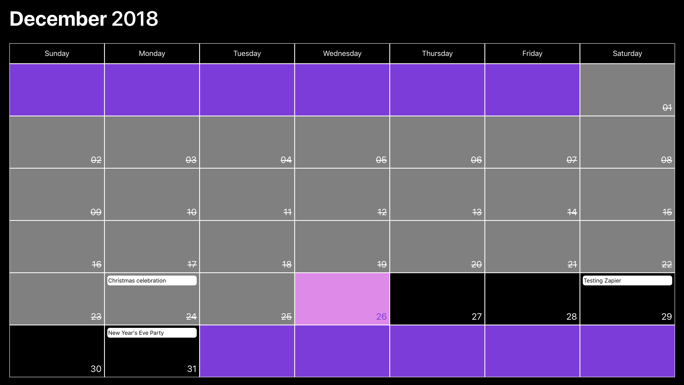

# Gatsby Starter: Event Calendar 📅



[](https://greenkeeper.io/)
[](https://travis-ci.org/EmaSuriano/gatsby-starter-mate)
[](https://eslint.org/)
[](https://github.com/prettier/prettier)

> A calendar starter integrated with Google Spreadsheet.

The target audience are Event Organizers or Meetups 😄

### [Medium Story ✍️](https://medium.com/p/5989b283c937/)

### [Demo 🌵](https://gatsby-starter-event-calendar.netlify.com/)

## Why? 🤔

Have you ever manage multiple events at the same time that you have to share with people? It can a be hard task, due to all the possible things that can happened: new events, change the date of other or someone remove/cancel his event. This starter is to help you with that!

It grouped all the events submitted via Google Form, which are stored inside a Google Spreadsheet and then display all of them in beatiful Calendars. As the entry point of event is Google Form this is a 100% collaborative tool with the power of editing and removing old entries by the owner or by you (the Admin).

## Features 🛠

- [Gatsby](https://www.gatsbyjs.org/)
- [Grommet](http://grommet.io): A react-based framework that provides accessibility, modularity, responsiveness, and theming in a tidy package
- Dynamic content from [Google Spreadsheet](https://www.google.com/sheets/about/)
- Offline support
- A11y support: content and navigation ready for screen readers.
- PWA ready
- SEO
- Responsive design
- Icons from [grommet-icons](https://github.com/grommet/grommet-icons)
- [Netlify](https://www.netlify.com) Deployment Friendly
- Developer tools:
  - eslint
  - prettier

## How to start ▶️

If you never used Gatsby before, I highly recommend you to [set up your development environment](https://www.gatsbyjs.org/tutorial/part-zero/)!

To copy and install this starter run this command:

```bash
$ gatsby new event-calendar https://github.com/EmaSuriano/gatsby-starter-event-calendar
```

The main data source of this starter is a Google Spreadsheet linked with a Google Form, so the first thing we have to do is [create one](http://forms.new). Here you can create the questions that the user have to complete to submit the form, in my case I have the following structure:



**The text you pick for all the questions can differ from mine, then inside the application you can apply an alias inside the GraphQL Query**

Once the form created, you need to generate an Spreadsheet from it. For that, move to the Responses Tab and click on the green Spreadsheet logo which says "View Responses in Sheets". This will create a Spreadsheet that will be automatically updated when someone make a new entry inside the form. This will be the source of the application.

Next, you need to have access from the applicaiton to read the Spreadsheet. You need to navigate to your Google API Dashboard and then go to Credentials which is on the left panel. There you click on "Create credentials" and add a new Service account key.

You'll be redirected to a new page to create the service account key, just make sure the option of "App Engine default service account" is selected and the key type marked as JSON. Click on the Create button and you will download a JSON file with your credentials, copy the value of `client_email` and share the spreadsheet with that mail, and that's it! This is how you are enable to read the document from an external application 🎉

The last step is to configure our application to know from where it has to fetch the data, this is going to be made by using `enviroment variables`. You need to create a file called `.env` inside the root of the directory, with the following structure:

```javascript
PRIVATE_KEY=// your private_key
PRIVATE_KEY_ID=// your private_key_id
PROJECT_ID=// your project_id
```

Then go to `gatsby-config.js` and look for the options of `gatsby-source-google-sheets`, and change the values of:

- `spreadsheetId`: you can find this value inside the URL of the spreadsheet. `https://docs.google.com/spreadsheets/d/[spreadsheetId]`
- `worksheetTitle`: this is the name of the sheet from which you want to read the information.

Now you are ready to start the project, fetching all the events inside the Spreadsheet and displaying Calendars with them!

```
> yarn
> yarn start
```

## Mapping your question with Query structure

The way that Gatsby works to fetch data is by using Graphql StaticQuery. It receives a prop called `query` where you define which information we want from our Graphql layer and another prop `render` which is a function that receives the result of the query with all the data.

In this case, you don't need the whole render to adapt the project to your questions, just by changing the `query` will be enough 😄

Graphql queries have a concept called `alias` that allows to rename a variable the query, and this is exactly what you need to properly mapped all the questions.

This an example of my `query`:

```javascript
import { graphql } from 'gatsby'

const SPREADSHEET_QUERY = graphql`
  query eventsQuery {
    allGoogleSheetEventsRow {
      edges {
        node {
          id
          eventName: whatisthename
          date: when
          place: where
          eventLink: linktotheevent
        }
      }
    }
  }
`
```

The important part here it's that you have to use the **same** names on the left part of the query.

The name of the variables of your spreadsheet are the name of the columns, which are a short version of the question (removing caps, spaces and symbols). So in the case that you first question is "Name of the event", the resulting query will be:

```javascript
import { graphql } from 'gatsby'

const SPREADSHEET_QUERY = graphql`
  query eventsQuery {
    allGoogleSheetEventsRow {
      edges {
        node {
          id
          eventName: nameoftheevent
          date: when
          place: where
          eventLink: linktotheevent
        }
      }
    }
  }
`
```

One more thing if you've never worked with Gatsby before, it provides a [Graphql playground](http://localhost:8000/___graphql) where you can try your queries without the overhead of recompiling the project. I highly recommend using it to generate your own query for the events.

## App Configuration

Inside the root folder there is a file called `appConfig.js`, which allow you to customize the starter with your own preferences. It has the following structure:

```json
{
  "title": "Gatsby Starter Event Calendar",
  "subTitle": "The easiest option to share events!",
  "formLink": "https://goo.gl/forms/u00WBxeK1kQco0uQ2",
  "maxAmountEvents": 2,
  "limitMonthInTheFuture": 2,
  "theme": {}
}
```

All these values can be changed by the developer and in case one of them it's not defined they all have defualt values. Inside the application this values are being accesed using the component called `ConfigContext` which is a basic implementation of `React Context`.

### Theming

`Grommet` has a prop called theme when the developer can set all the colors that are going to be used inside the application. Therefore there are some `standard` colors, like `background` and `text`, but there is a whole object just to configure how the `Calendar` is going to look like.

You can change any of the existing themes or create your own following this structure:

```json
{
  "background": "white",
  "brand": "pink",
  "secondary": "violet",
  "focus": "pink",
  "text": "black",

  "calendar": {
    "today": {
      "background": "pink",
      "text": "violet",
      "border": "grey"
    },
    "day": {
      "background": "white",
      "text": "black",
      "border": "grey"
    },
    "past": {
      "background": "lightgrey",
      "text": "black",
      "border": "grey"
    },
    "empty": {
      "background": "lightblue",
      "border": "grey"
    },
    "weekdays": {
      "background": "white",
      "text": "black",
      "border": "grey"
    },
    "event": {
      "background": "white",
      "text": "black"
    },
    "modal": {
      "text": "black",
      "background": "white"
    }
  }
}
```

Inside the folder [themes](./themes) you can find a few examples I made to show how versatile is the theming in this applicaion. Here are some screenshots:

#### Main (Used in Demo page)



#### Base



### Dark



### Transparent


## Building your site 📦

Change the name of the variables of below to 3 this project is using.

As we are dealing with environment variables, the `.env` file is excluded from `.gitignore` file. Therefore, in order to deploy the website you have to send `PRIVATE_KEY`, `PRIVATE_KEY_ID` and `PROJECT_ID` with the `build` command.

```bash
PRIVATE_KEY=xxxxx PRIVATE_KEY_ID=yyyyy PROJECT_ID=wwwww yarn build
```

The result will be stored inside the `public` folder, so you can upload to your webhost. I highly suggest using this starter with Netlify when you can define which command will build the project and also send the environment variables inside the website configuration 👌

## Project structure 🏗

Event calendar starter is a SPA (Single Page Application), so basically it has only two pages:

- Index.js (page itself)
- 404.js (nice 404 error page that match the style)

The structure for the main page is the following:

```javascript
<PageLayout>
  <Hero />
  <Calendar>
    <Month />
    <Month />
  </Calendar>
  <ModalEvent />
</PageLayout>
```

`PageLayout` is the main of the application, it creates the `ConfigContext` where we have access to all the information inside `appConfig.js` and renders `Grommet` wrapper with the theme of the application.

`Hero` display almost all the information define in `appConfig`, like title, subtitle and a `Button` that redirect to the `formLink` so people can add new event from the page.

`Calendar` is in charge of executing the query to get the events, then group them by month and render a `Month` component with the grouped events. The ammount of rendered `Month` can be changed inside `appConfig.js`.

`ModalEvent` is the popup that is going to be showed when someone click on a day with events, and it renders the information of all the events for that day.

## Contributing 💪

I came with the idea of creating this starter after making a page for a friend with the same concept but it was totally attached to only one spreadshet and lots of hardcoded information.

Therefore this starter is not perfect! I did my best to abstract all the logic to configuration files and I hope you find the code understandable and readable 😅

I'm totally for new PRs with bug fixes, change in Documentation, and new features to the starter 🙌

## License 📝

MIT.
